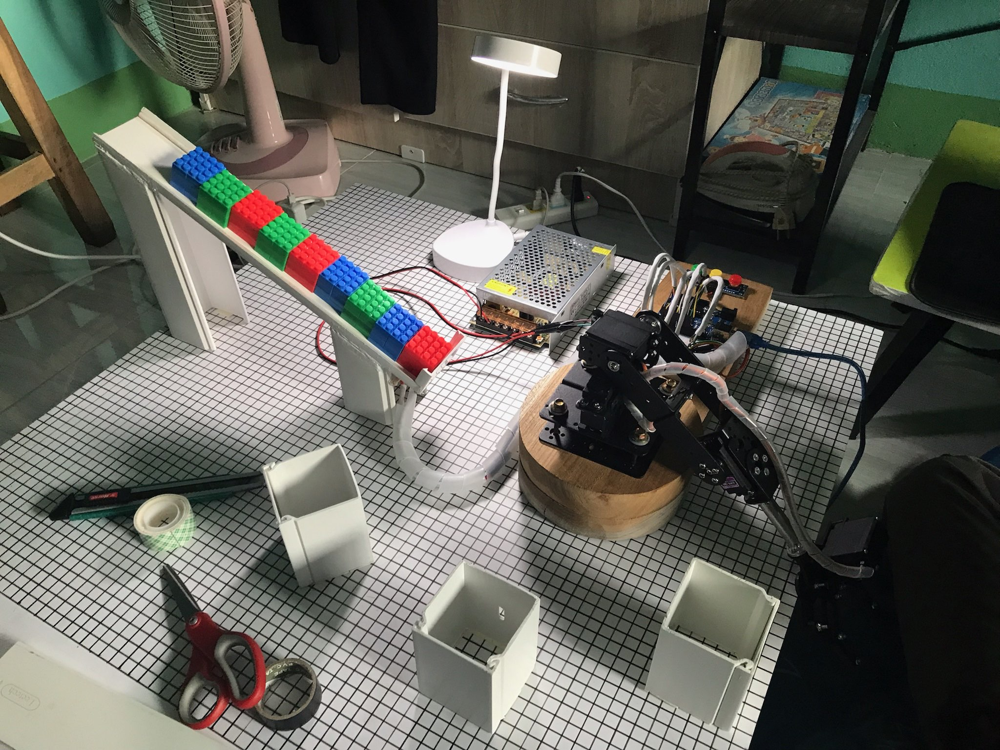

# 🤖 Color-sorting-Robotic-Arm

Control a robotic arm with Arduino using the `robotarm.ino` sketch.  
Designed for an easy start: clear wiring, configurable pins, angle limits,
and example motion sequences.



<p align="center">
  <a href="#features">Features</a> •
  <a href="#hardware">Hardware</a> •
  <a href="#wiring-quick-start">Wiring</a> •
  <a href="#getting-started">Getting Started</a> •
  <a href="#servo-calibration">Calibration</a> •
  <a href="#project-structure">Structure</a> •
  <a href="#customization">Customization</a> •
  <a href="#troubleshooting--faq">FAQ</a>
</p>

---

## 🌟 Features

- Control **multiple DOF** with standard hobby servos  
- Per-joint **angle limits** to prevent overtravel and wire strain  
- Example **motion sequence** demo inside the sketch  
- **Calibration mode** to quickly find each joint’s home/center  
- Clean, extendable code—ready for buttons, joystick, Bluetooth, or web UI

> **Note:** This repo focuses on the `robotarm.ino` sketch.  
> The `image/` folder contains illustrations used by this README.

---

## 🧩 Hardware

- Arduino board (UNO/Nano/MEGA or compatible)  
- 3–6× servo motors (SG90 / MG996R or similar)  
- **Dedicated 5–6 V power supply for servos** (recommended)  
- Dupont wires, breadboard/power module  
- Robotic arm frame (3D-printed/acrylic/kit)

> ⚠️ **Power Safety:** Always share **GND** between the servo PSU and the Arduino
> (**common ground**).

---

## 🔌 Wiring (Quick Start)

| Part | Connect to | Notes |
| --- | --- | --- |
| Servo 1 signal | `D2` (example) | Change pins in code |
| Servo 2 signal | `D3` |  |
| Servo 3 signal | `D4` |  |
| … | … | Add as needed |
| Servos V+ | External 5–6 V | Avoid powering many servos from Arduino 5 V |
| Servos GND | PSU GND **and** Arduino GND | Common reference |

> See `image/wiring.png` (rename here if your file differs).

---

## 🚀 Getting Started

1. **Install Arduino IDE** and select the correct board/port.  
2. Open `robotarm.ino`.  
3. Review **servo pins** and **limits** in the config section at the top.  
4. Click **Upload**.  
5. Open **Serial Monitor** (e.g., 115200 baud) for status/calibration prompts.

> Using PlatformIO? Place the sketch in your project and upload as usual.

---

## 🎯 Servo Calibration

1. Remove horns/arms first (prevents mechanical crashes).  
2. Enter the sketch’s **calibration mode** (via a flag/menu in Serial).  
3. Move each servo to **center (≈90°)**.  
4. Reattach horns/links so they’re parallel/square.  
5. Set **min/max limits** for each joint and re-upload.

Example variables you might see at the top of the sketch (adjust to your code):

```cpp
// Example pins (edit to match your wiring)
const int SERVO_PINS[] = {2, 3, 4, 5}; // D2..D5

// Per-joint angle limits [min, max]
const int LIMITS[][2] = {
  {10, 170},
  {15, 165},
  {0, 180},
  {30, 150}
};
